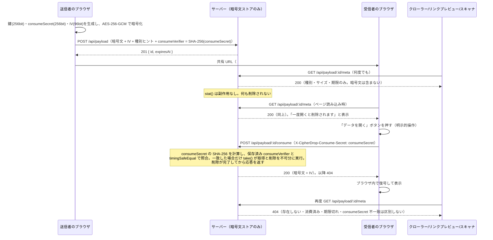

# CipherDrop セキュリティ・ホワイトペーパー

最終更新日: ［YYYY-MM-DD］ ／ 対象バージョン: `main` ブランチ

本書は CipherDrop の暗号アーキテクチャと、それを支える実装上の保証を、技術的な読者（B2B 導入前の
セキュリティ審査担当者、監査人、OSS コントリビューター）向けに解説するものです。記載内容はすべて
本リポジトリの実装（[`apps/frontend/src/crypto.ts`](../apps/frontend/src/crypto.ts)・
[`apps/backend/src/server.ts`](../apps/backend/src/server.ts) ほか）と対応しており、
[`tests/`](../tests/) 配下の自動テストで継続的に検証されています。運用ポリシーの要約は
[`SECURITY.md`](../SECURITY.md)、法的な文書は [`PRIVACY.md`](../PRIVACY.md) / [`TERMS.md`](../TERMS.md)
を参照してください。

## 1. 概要

CipherDrop は、**ゼロ知識設計**の一時データ共有サービスです。暗号化・復号は送信者・受信者それぞれの
ブラウザ内で完結し、サーバーは暗号文以外の秘密（平文・復号鍵）を一切保持しません。データは
**1 回の受信、または設定した有効期限のいずれか早い方**で、サーバーから物理的に削除されます。

| 要素 | 実装 |
| --- | --- |
| 暗号方式 | AES-256-GCM（認証付き暗号） |
| 暗号ライブラリ | Web Crypto API（`crypto.subtle`）のみ。外部ライブラリへの依存なし |
| 鍵の生成 | `crypto.subtle.generateKey` による CSPRNG ベースの新規生成（1 メッセージにつき 1 鍵） |
| 鍵の伝送経路 | 共有 URL のフラグメント（`#` 以降）のみ。HTTP リクエストに含まれない |
| サーバーの保持物 | 暗号文・IV・表示用メタデータ（種別ヒント・サイズ・有効期限・鍵確認値［任意］） |
| 削除保証 | 取得（消費）と削除が不可分（アトミック）。取得後の復元は不可能 |
| バックエンドの依存 | ランタイム npm パッケージ 0（`node:*` のみ） |

## 2. 脅威モデルとスコープ

### 2.1 前提（信頼するもの）

- **エンドポイントの健全性**: 送信者・受信者のブラウザおよびデバイスが侵害されていないこと。
- **配信物の完全性**: そのつどブラウザへ配信される JavaScript（暗号化・復号のコード）が、配信時点で
  改ざんされていないこと。これは、サーバー自身が能動的に鍵を盗む意思を持った場合には破られ得る前提です
  （§7 で詳述）。
- **Web Crypto API の実装**: ブラウザベンダーが提供する `crypto.subtle` の実装が正しいこと。

### 2.2 CipherDrop が防ぐもの

- **サーバー運用者による内容の閲覧**: サーバーは暗号文以外の秘密を保持しないため、運用者・
  インフラ管理者・当該インフラへの法的な差押えのいずれも、内容を復号できません。
- **通信経路上の盗聴者による内容の閲覧**: TLS に加えて、そもそもサーバーへ平文・鍵が渡らないため、
  仮に TLS が破られても内容は暗号文のままです。
- **受信者が開く前のデータ消失**: リンクプレビュー・クローラー・セキュリティスキャナ等が共有 URL に
  GET でアクセスしても、データは消費されません（§4）。
- **受信後の再取得**: 一度受信（消費）されたデータは、サーバー上から物理的に削除され、二度と取得できません。
- **ID だけを知る第三者による早期消費**: 共有 ID（128bit・URL パスに載るためサーバーログ等に残り得る）を
  知っているだけでは `consume` できません。復号鍵とは独立した `consumeSecret`（URL フラグメントにしか
  存在しない秘密）の一致が必須です（§4.1）。
- **単一送信元からの連投（レート制限）**: 配信層（nginx）で IP 単位の同時接続数・リクエスト頻度を制限し、
  低速な接続によるワーカー占有（Slowloris 等）を自動的に切断します（§7）。

### 2.3 CipherDrop が防がないもの（既知の境界）

- **配信物の改ざん**: 悪意を持つ（または侵害された）配信サーバーが暗号化・復号コード自体を改ざんすれば、
  新たに生成される鍵を盗むことは理論上可能です。これは「配信のたびにコードを取得する」Web アプリ全般に
  共通する限界であり、ソースの公開・再現可能ビルド・Subresource Integrity（SRI）・専用クライアント配布等が
  根本的な緩和策になります（現時点では未実装。README「信頼モデルと既知の制約」参照）。
- **受信者側での漏えい**: 復号後の平文は受信者のブラウザのメモリ・画面上に存在します。受信者のデバイスが
  侵害されている場合、これを守ることはできません。
- **URL の伝送経路**: 共有 URL（鍵・consumeSecret を含む）自体をどう相手に届けるか（メール・チャット等）は
  本サービスの範囲外であり、その経路の安全性はユーザーの選択に依存します。
- **利用者認証・分散した連投**: 本 MVP はユーザー認証（アカウント・ログイン）を実装していません。
  レート制限は IP 単位（§7）であるため、多数の IP に分散した連投（分散 DoS）までは防げません。

## 3. 暗号アーキテクチャ

### 3.1 使用アルゴリズム

- **AES-256-GCM**（鍵長 256bit、IV 96bit/12 バイト、認証タグ 128bit）。呼び出しごとに新しい鍵と IV を
  CSPRNG（`crypto.subtle.generateKey` / `crypto.getRandomValues`）で生成します。鍵・IV の使い回しは
  一切行いません。
- **SHA-256** は、後述する鍵確認値（§5）の計算にのみ使用します。**AES 鍵の導出には使用しません**
  （§3.2 参照）。

### 3.2 鍵の生成方式について（PBKDF2 等のパスワード鍵導出関数は使用しない）

CipherDrop の復号鍵は、**人間が記憶するパスワードから導出されたものではありません**。
`crypto.subtle.generateKey({ name: 'AES-GCM', length: 256 }, ...)` によって、メッセージごとに
新しい 256bit の鍵を直接生成し、その鍵は共有 URL のフラグメントにのみ載せて受信者に渡します。

PBKDF2・scrypt・Argon2 のようなパスワードベースの鍵導出関数（KDF）は、**低エントロピーな人間の記憶に
依存する秘密**（パスワード）を、反復計算によって総当たり攻撃に強くするための仕組みです。CipherDrop は
そもそも人間が記憶・入力するパスワードを鍵にしていないため、この種の KDF は必要としません。256bit の
乱数鍵に対する総当たりは、反復計算の有無にかかわらず非現実的です。

> 将来的に「合言葉（パスフレーズ）による追加の保護層」を提供する場合は、その合言葉から鍵を導出する
> 段階で PBKDF2 や Argon2id のような KDF を新たに導入することになります。これは現時点では実装されて
> いない、あくまで拡張の余地です。

### 3.3 鍵の伝送経路

```
https://cipherdrop.io/v/{id}#{key}.{consumeSecret}
                       └──┬──┘ └────────┬────────┘
        サーバーに届く ◀───┘             └───▶ ブラウザの外には出ない（HTTP リクエストに含まれない）
```

URL のフラグメント識別子（`#` 以降）は、ブラウザの仕様上 HTTP リクエストの一部として送信されません。
これは CipherDrop 独自の実装ではなく、URL/HTTP の標準的な挙動に基づく構造的な保証です。
[`apps/frontend/src/api.ts`](../apps/frontend/src/api.ts) の API クライアントは、そもそも鍵を引数として
受け取れないようにも設計されており（型として存在しない）、実装ミスで鍵を送ってしまう経路そのものを
排除しています。

フラグメントには、復号鍵（`key`）とは別に、`consume`（1 回限りの取得・削除）を許可するためだけの
独立した秘密（`consumeSecret`）も `.` 区切りで載せています。区切りに `.` を使えるのは、鍵と
`consumeSecret` の符号化（base64url、文字集合 `[A-Za-z0-9_-]`）がそもそも `.` を生成しないためで、
どちらの値にも `.` が紛れ込む余地がなく曖昧さがありません（JWT が `.` を区切りに使うのと同じ理由）。
`consumeSecret` の設計は §4.1 で詳述します。

### 3.4 平文エンベロープ

暗号化される直前の平文には、1 バイトのフォーマットタグを先頭に付与します。このタグも AES-GCM の
認証対象に含まれるため、サーバーが「テキストなのかファイルなのか」を偽装することはできません
（改ざんは復号時に検出されます）。

| タグ | 種別 | 本体 |
| --- | --- | --- |
| `0x01` | テキスト | UTF-8 バイト列 |
| `0x02` | バイナリ | バイト列 |
| `0x03` | ファイル | `[u16 BE 名前のバイト長][名前 UTF-8][ファイルのバイト列]`（ファイル名も暗号文の内側） |

ファイル名は送信者が自由に決められる値であり、暗号文の外側（サーバーが見える領域）には一切現れません。

## 4. 2 段階消費 API（誤消費・早期消滅の防止）

初期の実装では「GET で取得すると同時に削除する」単純な 1 段階 API を採用していましたが、チャットアプリの
リンクプレビュー生成・セキュリティスキャナ・クローラーが URL を自動的に GET するだけで、正規の受信者が
開く前にデータが消えてしまう問題がありました。これを防ぐため、確認（副作用なし）と消費（破壊的操作）を
明確に分離しています。



- `GET /api/payload/:id/meta` は **状態を一切変更しません**。何度呼んでも、誰が呼んでも、暗号文は消えません。
- `POST /api/payload/:id/consume` **だけ**が暗号文を取得でき、正しい `consumeSecret` を提示した場合だけ
  取得と同時に不可分に削除します。削除が完了する前に応答を書き出すことはありません（並行して 50 件同時に
  リクエストしても、成功するのは 1 件だけであることをテストで検証しています）。
- GET・HEAD・OPTIONS 等、副作用を持たないメソッドが `consume` を実行することは実装上あり得ません
  （ルーティングの時点で POST 以外は 405 を返し、ストアに触れません）。

この設計により、「受信者が開く前にリンクプレビューが誤って消費してしまう」事故を防ぎつつ、
「一度読んだら消える」という一次的な保証そのものは維持しています。

### 4.1 消費権限の分離（Consume Secret）

上記の 2 段階 API は「いつ・どの HTTP メソッドで」消費が起こり得るかを制限しますが、それだけでは
「**誰が**消費できるか」までは制限しません。共有 ID（128bit のランダム値）は URL パス
（`/api/payload/{id}/...`）に露出するため、サーバーのアクセスログ・ブラウザ履歴・共有時の見た目などから
第三者に知られる可能性が、鍵（URL フラグメントにしか存在しない）よりも相対的に高くなります。ID だけを
知る第三者が `POST .../consume` を叩けば、正規の受信者より先にデータを破棄できてしまう（結果的に DoS に
なる）という構造的な弱点が残ります。

これを閉じるため、共有 URL のフラグメントには、復号鍵（`key`）とは独立したもう 1 つの 256bit CSPRNG
値（`consumeSecret`）を追加しています（§3.3）。

- **作成時**: 送信者のブラウザが `consumeSecret` を生成し、その **SHA-256 全体**（`consumeVerifier`、
  16進 64 桁）だけを `X-CipherDrop-Consume-Verifier` ヘッダーでサーバーへ送ります。サーバーは
  `consumeVerifier` を保存しますが、`consumeSecret` 自体を見ることはありません。任意項目の鍵確認値
  （§5）と異なり、**省略できません**（無いと、正当な受信者であっても後で consume できるデータを
  作れてしまうため）。
- **消費時**: 受信者のブラウザが、URL から取り出した `consumeSecret` を `X-CipherDrop-Consume-Secret`
  ヘッダーで送ります。サーバーは受け取った値の SHA-256 を計算し、`crypto.timingSafeEqual`
  （タイミング攻撃対策。バイト長の事前比較も、比較自体が値に依存しないため安全）で保存済みの
  `consumeVerifier` と比較します。一致した場合**だけ** `take()` を実行します。
- **一致しない場合**、ID が存在しない場合・取得済みの場合・期限切れの場合と**全く同じ** `404` を返します
  （ステータス・ヘッダー・本文のいずれも区別できません）。これにより、ID だけを知る攻撃者に対して
  「このヘッダーさえ整えれば何かが存在するかどうか分かる」というオラクルを与えません。期限切れの
  エントリに対しても、consumeSecret の検証自体は行ってから応答することで、「期限切れ」と「秘密鍵の
  不一致」を応答時間の差から区別しにくくしています。

`consumeSecret` は鍵と同じ 256bit・base64url 形式を使いますが、これは総当たり耐性のためではありません
（そもそも「知識の証明」として使うだけで、鍵のように暗号強度が直接問われる値ではありません）。既存の
`isValidKeyString` の検証ロジックをそのまま再利用できる、実装上の単純さのために同じ形式を選んでいます。
同じ理由（256bit の CSPRNG 値には低エントロピーな総当たりリスクが無い）で、`consumeVerifier` の計算にも
鍵確認値（§5）と同様、パスワードハッシュ用の KDF（PBKDF2 等）ではなく単純な SHA-256 を使っています。

## 5. 鍵確認値（Key Check Tag）

共有 URL のコピペミスや途中欠損により、**形式としては正しいが内容が違う鍵**で「開く」を押してしまうと、
AES-GCM の認証が失敗し、復号に失敗した時点で初めてデータが失われていたことに気づく、という事故が
起こり得ます。鍵確認値は、この種の事故を**消費する前に**検出するための仕組みです。

### 5.1 仕様

```
generateKeyCheckTag(key) = HEX( SHA-256("cipherdrop-key-check-v1:" + key) [0:4] )
```

- SHA-256 ハッシュの**先頭 32bit（4 バイト）** を、16 進数の小文字 8 桁として表現します。
- ドメイン分離のための固定接頭辞（`cipherdrop-key-check-v1:`）を鍵の前に付けてからハッシュ化することで、
  この値が他の用途のハッシュと衝突・混同しないようにしています。

### 5.2 データフロー

1. 送信者のブラウザが、生成した鍵から鍵確認値を計算し、`X-CipherDrop-Key-Check` ヘッダー（任意）として
   暗号文と一緒に送信します。
2. サーバーは値の意味を解釈せず、そのまま保存し、`GET .../meta` の応答にそのまま含めて返します。
3. 受信者のブラウザは、URL の鍵から**ローカルで**同じ計算を行い、サーバーから返ってきた値と照合します。
4. **不一致が確実に判明した場合のみ**、「開く」ボタン自体を描画せず、`POST .../consume` を発行する
   手段を作りません。判定できない場合（値が省略されている・計算自体が失敗した）は安全側に倒し、
   通常どおり続行します（誤検出によって正しいデータへの到達を妨げないため）。

### 5.3 プライバシー上のトレードオフ（明示的な開示）

この仕組みは、絶対遵守ルール「復号鍵をサーバーに送らない」の**例外ではありません**。サーバーへ送るのは
鍵そのものではなく、鍵の一方向関数の出力の**ごく一部（32bit）**だけです。

- **一方向性**: 32bit のハッシュ値から、元の 256bit の鍵を復元することはできません。
- **総当たりへの寄与は非現実的**: 256bit の鍵空間を 32bit 分絞り込んでも、残り 224bit の全数探索は
  依然として非現実的です。この値が鍵の総当たりを実用的に助けることはありません。
- **ただし、完全なゼロ知識ではなくなる**: 「サーバーは鍵について一切の情報を持たない」という意味での
  厳密なゼロ知識は、この 32bit の情報によって理論上は成立しなくなります。これは、コピペミスによる
  データ消失を防ぐという実用上の利益と引き換えに、意図して受け入れているトレードオフです。
  **鍵確認値は送信時に省略可能**であり、省略した場合はこの限定的な情報開示自体が発生しません。

この機能は任意（オプトイン）であり、省略した場合は从来どおり「消費後の復号失敗で初めて鍵の誤りが
判明する」動作になります。

## 6. バックエンドの設計

- **ランタイム依存パッケージ 0**。`node:http` と `node:crypto`（ID・IV・consumeSecret の乱数生成、
  ハッシュ計算、`timingSafeEqual`）のみで実装されており、この制約は `tests/security-policy.test.ts` が
  import 文を静的解析して機械的に強制しています。サプライチェーン攻撃の対象となる npm パッケージが
  実行時に存在しません。
- **インメモリストア（MVP）**。`PayloadStore` インターフェースは `put` / `stat`（副作用なし）/
  `take`（consumeSecret の検証・取得・削除が不可分）に加え、本文を読み始める前の容量予約を行う
  `reserve` / `release` を公開し、「削除せずに暗号文を読む」経路をインターフェースの形そのもので
  排除しています。プロセス再起動時、未取得の暗号文はすべて失われます。
- **サイズ・容量上限と事前予約（OOM 対策）**。合計バイト数（既定 512 MiB）・件数（既定 10 万件）の
  両方に上限を持ちます。`POST /api/payload` は、宣言された `Content-Length` を読み取り、上限を超える場合
  や、ストアの残り容量（バイト数・件数のいずれか）が足りない場合は、**本文を 1 バイトも読まずに** `413`
  / `503` を返します（多数の同時アップロードが、入りきらないと分かっている本文をそれぞれバッファリング
  してメモリを枯渇させる攻撃への対策）。予約（`reserve`）と確定（`put`）は別カウンタで管理し、
  本文読み取りの成否に関わらず `release` してから `put` するため、二重計上は起こりません。本文の読み取り
  自体も、宣言サイズが分かっている場合はチャンク配列の再結合（二重確保）を避け、ゼロ初期化した単一の
  バッファへ直接コピーします（`allocUnsafe` ではなく `alloc` を使い、宣言と実際のバイト数が食い違っても
  未初期化のプロセスメモリが暗号文と称して紛れ込む余地を残しません）。
  Slowloris 対策として、アプリ層でも `headersTimeout` / `requestTimeout` / `keepAliveTimeout` を
  設定しています（配信層の対策は §7）。
- **固定スキーマのログ**。出力できるログイベントの型が固定されており、URL・クエリ・ヘッダー・
  リクエスト本文・ID・暗号文はログの型として存在しないため、構造的に混入し得ません。

## 7. 配信層の保護

- **HSTS**: `Strict-Transport-Security: max-age=31536000; includeSubDomains; preload` を配信層
  （`deploy/security-headers.conf`）・バックエンド（`server.ts` の `BASE_HEADERS`）の双方で付与します。
- **CSP**: `default-src 'none'` を基本とし、必要な送信元（`'self'`）のみを個別に許可します。
  ビルド済み HTML には `<meta>` として CSP を埋め込みますが、`<meta>` では `frame-ancestors` が
  効かないため、配信層のレスポンスヘッダーで `frame-ancestors 'none'` を強制しています
  （`tests/infra.test.ts` が両者の内容が食い違っていないかを機械的に検査します）。
- **X-Content-Type-Options: nosniff** / **X-Frame-Options: DENY** / **Referrer-Policy: no-referrer**
  も同様に、配信層とバックエンドの双方で付与します。
- **IP 単位のレート制限（DoS 対策）**: nginx の `limit_conn_zone` / `limit_req_zone`（`$binary_remote_addr`
  単位）で、同時接続数・リクエスト頻度の双方を制限します（`deploy/nginx.conf`）。上限超過は
  `429 Too Many Requests`。
- **低速接続のタイムアウト（Slowloris 対策）**: `client_header_timeout` / `client_body_timeout` /
  `send_timeout` を設定し、ヘッダー・本文の送受信が極端に遅い接続を自動的に切断します。
  バックエンド自身のタイムアウト（§6）と合わせた多層防御です。
- **安全なアクセスログ**: 既定の `combined` 形式は URI・クエリ文字列（ペイロード ID を含む）をそのまま
  記録しますが、`deploy/nginx.conf` はこれを含まないカスタム書式（`cipherdrop_safe`）を使い、
  バックエンド自身の構造化ログ（§6）と同じ方針を配信層にも適用しています。
- **非 root 実行**: コンテナは `USER node`（非 root）で動作し、静的配信・API リバースプロキシを担う
  nginx も非特権ポート（8080）で待ち受けます（`Dockerfile` / `deploy/`）。
- **CI によるハードニング**: push・PR ごとに `npm run check`（AST によるポリシー検査を含む）・
  `npm run build`・`npm audit --audit-level=high` を実行し、いずれか 1 つでも失敗すれば
  マージ前に検知できるようにしています（`.github/workflows/ci.yml`）。

## 8. 既知の制約（要約）

詳細は [README「信頼モデルと既知の制約」](../README.md#信頼モデルと既知の制約) を参照してください。

- 配信される JavaScript 自体の改ざんは、本アーキテクチャの前提の外にあります（§2.3）。
- 利用者認証（アカウント・ログイン）は未実装です。レート制限は IP 単位であり、多数の IP に分散した
  連投までは防げません（§2.3、§7）。
- ページの JavaScript を実行したうえでボタンまで自動操作するスキャナは、理論上データを消費し得ます。
- メタデータ（サイズ・種別ヒント・作成/期限時刻・鍵確認値［あれば］）はサーバーから見えます。

## 9. 検証方法

本書の記述は、以下の自動テストで継続的に裏付けられています。

- `tests/zero-knowledge.e2e.test.ts` — 実際の TCP 通信を生バイト列で記録し、鍵・consumeSecret（生の値）・
  平文がどのような符号化（生・16進・base64・部分列）でも一度も現れないこと（consumeSecret は消費
  リクエストのヘッダー以外に現れないこと）、正しい ID と誤った consumeSecret の組では消費できず暗号文も
  削除されないことを検証します。
- `apps/backend/src/store.test.ts` / `server.test.ts` — `consumeVerifier` の `timingSafeEqual` 照合
  （正しい／誤った／長さの異なる consumeSecret のいずれも例外にならないこと）、`reserve` / `release` に
  よる容量予約（バイト数・件数の両方の上限、期限切れの回収）、宣言サイズの時点で本文を読まずに `503`
  を返すことを検証します。
- `tests/security-policy.test.ts` — TypeScript の AST を解析し、`innerHTML` 等の HTML 挿入 API の
  不使用、バックエンドのランタイム依存 0、`consume` が「開く」ボタンのハンドラからしか呼ばれないこと等を
  機械的に強制します。
- `tests/infra.test.ts` — Dockerfile・nginx 設定・CSP の内容が、他のファイル（`vite.config.ts` の
  CSP、`package.json` の Node バージョン要件等）と食い違っていないか、nginx のレート制限・タイムアウト・
  安全なログ書式が定義されているだけでなく実際に適用されているかを突き合わせます。
- 鍵確認値のガード（§5.2）・consumeSecret のガード（§4.1）・2 段階消費（§4）の一部の性質は、実装を
  意図的に壊す変異テスト（ミューテーションテスト）でも検出力を確認しています。

`npm run check` により、これらすべてを含む自動テストをローカル・CI（`.github/workflows/ci.yml`）の
両方で実行できます。
